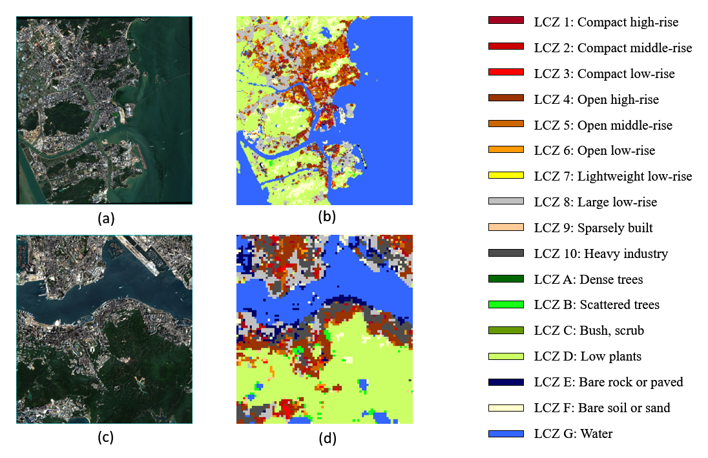

# DSLCZNET

## Figure - ErratumIn Figure 6, the color legend on the right omitted LCZ Class D. This has been corrected in the updated version below. The core code will be made publicly available soon.

